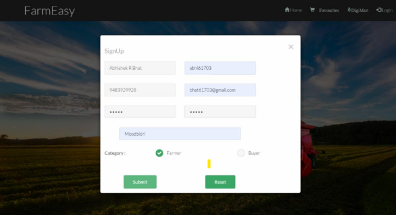
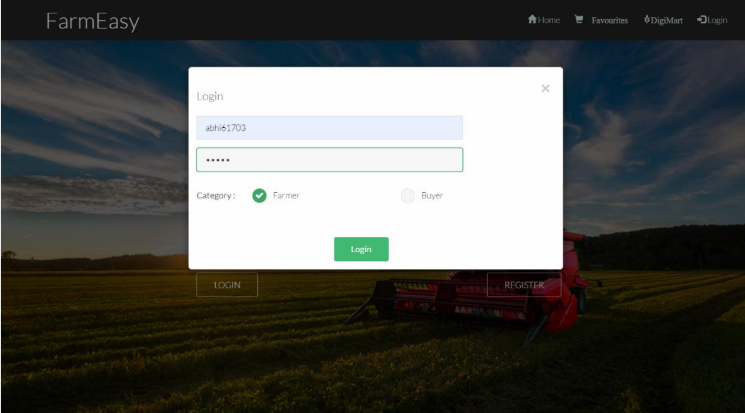
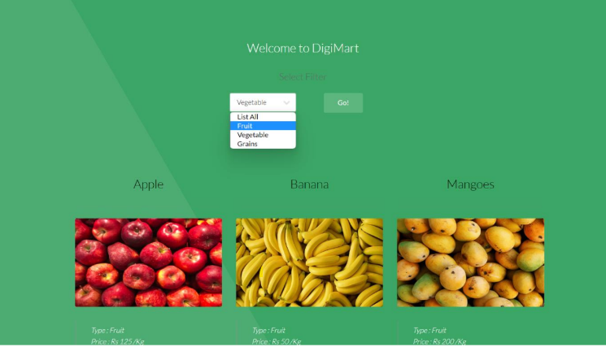
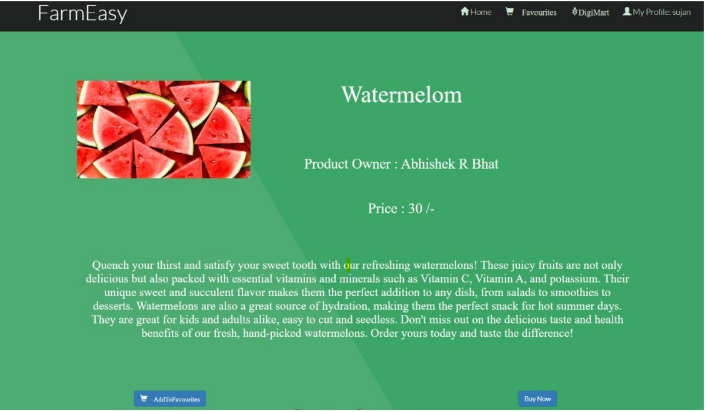

# Farmeasy
DBMS Mini Project
The Farmer-Consumer Management System is a software platform designed to bridge the gap
between farmers and consumers by providing a direct and transparent connection between the two. The
system is intended to help farmers increase their profits by connecting them directly with consumers and
eliminating the need for intermediaries. This can be achieved by providing farmers with tools to manage
their inventory and sales, and by giving consumers access to real-time information about the products
available from local farmers.

